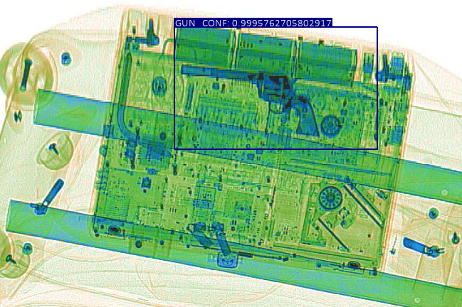
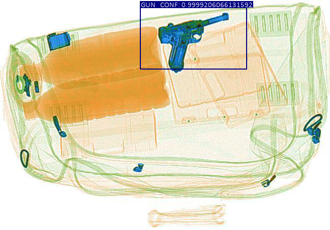
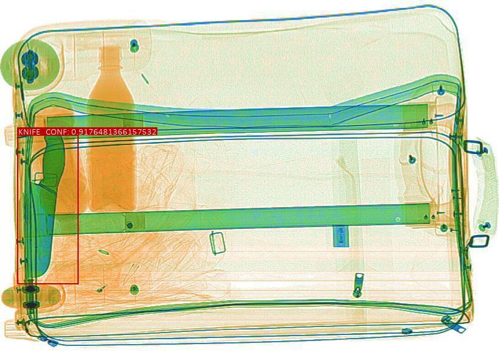
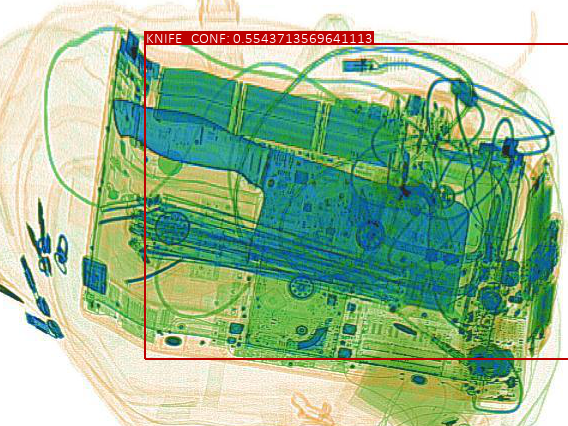

# Xray-object-detection
Illegal object detection using SSD300 
## Dataset
The dataset used in this project is the SIXray dataset. The SIXray dataset in this repository is a simplified version of the full dataset. The full dataset can be downloaded from https://github.com/MeioJane/SIXray. 
## How to use the SSD300
1. Download the repository

2. In the ssd directory
    1.   Train using `train.py`
    2.   Evaluate using `evaluate.py`
    3. To detect an image, run `detect.py`. Change image_path at line 96 to detect the image of your choice.

## Some results of our SSD300 model 
---
These are some results of our model trained for 50 epochs.

---

---

---

---
## References
* https://github.com/sgrvinod/a-PyTorch-Tutorial-to-Object-Detection
* https://github.com/chenyuntc/simple-faster-rcnn-pytorch
